# Projects and dependencies analysis

This document provides a comprehensive overview of the projects and their dependencies in the context of upgrading to .NETCoreApp,Version=v10.0.

## Table of Contents

- [Executive Summary](#executive-Summary)
  - [Highlevel Metrics](#highlevel-metrics)
  - [Projects Compatibility](#projects-compatibility)
  - [Package Compatibility](#package-compatibility)
  - [API Compatibility](#api-compatibility)
- [Aggregate NuGet packages details](#aggregate-nuget-packages-details)
- [Top API Migration Challenges](#top-api-migration-challenges)
  - [Technologies and Features](#technologies-and-features)
  - [Most Frequent API Issues](#most-frequent-api-issues)
- [Projects Relationship Graph](#projects-relationship-graph)
- [Project Details](#project-details)

  - [sharpie\src\Plugins\Sharpie.Plugins.SharpDX\Sharpie.Plugins.SharpDX.csproj](#sharpiesrcpluginssharpiepluginssharpdxsharpiepluginssharpdxcsproj)
  - [sharpie\src\Plugins\Sharpie.Plugins.Speech\Sharpie.Plugins.Speech.csproj](#sharpiesrcpluginssharpiepluginsspeechsharpiepluginsspeechcsproj)
  - [sharpie\src\Plugins\Sharpie.Plugins.UsbWatcher\Sharpie.Plugins.UsbWatcher.csproj](#sharpiesrcpluginssharpiepluginsusbwatchersharpiepluginsusbwatchercsproj)
  - [sharpie\src\Sharpie\Sharpie.Engine.Contracts\Sharpie.Engine.Contracts.csproj](#sharpiesrcsharpiesharpieenginecontractssharpieenginecontractscsproj)
  - [sharpie\src\Sharpie\Sharpie.Engine\Sharpie.Engine.csproj](#sharpiesrcsharpiesharpieenginesharpieenginecsproj)
  - [sharpie\src\Sharpie\Sharpie.Helpers.Core\Sharpie.Helpers.Core.csproj](#sharpiesrcsharpiesharpiehelperscoresharpiehelperscorecsproj)
  - [sharpie\src\Sharpie\Sharpie.Helpers.Telemetry\Sharpie.Helpers.Telemetry.csproj](#sharpiesrcsharpiesharpiehelperstelemetrysharpiehelperstelemetrycsproj)
  - [src\RotoGLBridge.Console\RotoGLBridge.ConsoleApp.csproj](#srcrotoglbridgeconsolerotoglbridgeconsoleappcsproj)
  - [src\RotoGLBridge.Tests\RotoGLBridge.Tests.csproj](#srcrotoglbridgetestsrotoglbridgetestscsproj)
  - [src\RotoGLBridge.UI\RotoGLBridge.UI.csproj](#srcrotoglbridgeuirotoglbridgeuicsproj)
  - [src\RotoGLBridge\RotoGLBridge.csproj](#srcrotoglbridgerotoglbridgecsproj)
  - [src\RotoUSB\rotoUSB.csproj](#srcrotousbrotousbcsproj)

## Executive Summary

### Highlevel Metrics

| Metric | Count | Status |
| :--- | :---: | :--- |
| Total Projects | 12 | 1 require upgrade |
| Total NuGet Packages | 19 | 6 need upgrade |
| Total Code Files | 111 |  |
| Total Code Files with Incidents | 1 |  |
| Total Lines of Code | 9200 |  |
| Total Number of Issues | 7 |  |
| Estimated LOC to modify | 0+ | at least 0.0% of codebase |

### Projects Compatibility

| Project | Target Framework | Difficulty | Package Issues | API Issues | Est. LOC Impact | Description |
| :--- | :---: | :---: | :---: | :---: | :---: | :--- |
| [sharpie\src\Plugins\Sharpie.Plugins.SharpDX\Sharpie.Plugins.SharpDX.csproj](#sharpiesrcpluginssharpiepluginssharpdxsharpiepluginssharpdxcsproj) | net10.0-windows | ✅ None | 0 | 0 |  | ClassLibrary, Sdk Style = True |
| [sharpie\src\Plugins\Sharpie.Plugins.Speech\Sharpie.Plugins.Speech.csproj](#sharpiesrcpluginssharpiepluginsspeechsharpiepluginsspeechcsproj) | net10.0-windows | ✅ None | 0 | 0 |  | ClassLibrary, Sdk Style = True |
| [sharpie\src\Plugins\Sharpie.Plugins.UsbWatcher\Sharpie.Plugins.UsbWatcher.csproj](#sharpiesrcpluginssharpiepluginsusbwatchersharpiepluginsusbwatchercsproj) | net10.0-windows | ✅ None | 0 | 0 |  | ClassLibrary, Sdk Style = True |
| [sharpie\src\Sharpie\Sharpie.Engine.Contracts\Sharpie.Engine.Contracts.csproj](#sharpiesrcsharpiesharpieenginecontractssharpieenginecontractscsproj) | net10.0-windows | ✅ None | 0 | 0 |  | ClassLibrary, Sdk Style = True |
| [sharpie\src\Sharpie\Sharpie.Engine\Sharpie.Engine.csproj](#sharpiesrcsharpiesharpieenginesharpieenginecsproj) | net10.0-windows | ✅ None | 0 | 0 |  | ClassLibrary, Sdk Style = True |
| [sharpie\src\Sharpie\Sharpie.Helpers.Core\Sharpie.Helpers.Core.csproj](#sharpiesrcsharpiesharpiehelperscoresharpiehelperscorecsproj) | net10.0-windows | ✅ None | 0 | 0 |  | ClassLibrary, Sdk Style = True |
| [sharpie\src\Sharpie\Sharpie.Helpers.Telemetry\Sharpie.Helpers.Telemetry.csproj](#sharpiesrcsharpiesharpiehelperstelemetrysharpiehelperstelemetrycsproj) | net10.0-windows | ✅ None | 0 | 0 |  | ClassLibrary, Sdk Style = True |
| [src\RotoGLBridge.Console\RotoGLBridge.ConsoleApp.csproj](#srcrotoglbridgeconsolerotoglbridgeconsoleappcsproj) | net10.0-windows | ✅ None | 0 | 0 |  | DotNetCoreApp, Sdk Style = True |
| [src\RotoGLBridge.Tests\RotoGLBridge.Tests.csproj](#srcrotoglbridgetestsrotoglbridgetestscsproj) | net10.0-windows | ✅ None | 0 | 0 |  | DotNetCoreApp, Sdk Style = True |
| [src\RotoGLBridge.UI\RotoGLBridge.UI.csproj](#srcrotoglbridgeuirotoglbridgeuicsproj) | net8.0-windows | 🟢 Low | 6 | 0 |  | Wpf, Sdk Style = True |
| [src\RotoGLBridge\RotoGLBridge.csproj](#srcrotoglbridgerotoglbridgecsproj) | net10.0-windows | ✅ None | 0 | 0 |  | ClassLibrary, Sdk Style = True |
| [src\RotoUSB\rotoUSB.csproj](#srcrotousbrotousbcsproj) | net10.0 | ✅ None | 0 | 0 |  | ClassLibrary, Sdk Style = True |

### Package Compatibility

| Status | Count | Percentage |
| :--- | :---: | :---: |
| ✅ Compatible | 13 | 68.4% |
| ⚠️ Incompatible | 2 | 10.5% |
| 🔄 Upgrade Recommended | 4 | 21.1% |
| ***Total NuGet Packages*** | ***19*** | ***100%*** |

### API Compatibility

| Category | Count | Impact |
| :--- | :---: | :--- |
| 🔴 Binary Incompatible | 0 | High - Require code changes |
| 🟡 Source Incompatible | 0 | Medium - Needs re-compilation and potential conflicting API error fixing |
| 🔵 Behavioral change | 0 | Low - Behavioral changes that may require testing at runtime |
| ✅ Compatible | 0 |  |
| ***Total APIs Analyzed*** | ***0*** |  |

## Aggregate NuGet packages details

| Package | Current Version | Suggested Version | Projects | Description |
| :--- | :---: | :---: | :--- | :--- |
| CommunityToolkit.Mvvm | 8.4.0 |  | [RotoGLBridge.UI.csproj](#srcrotoglbridgeuirotoglbridgeuicsproj) | ✅Compatible |
| coverlet.collector | 8.0.0 |  | [RotoGLBridge.Tests.csproj](#srcrotoglbridgetestsrotoglbridgetestscsproj) | ✅Compatible |
| HelixToolkit.Core.Wpf | 2.27.3 |  | [RotoGLBridge.UI.csproj](#srcrotoglbridgeuirotoglbridgeuicsproj) | ✅Compatible |
| HelixToolkit.SharpDX.Core | 2.27.3 |  | [RotoGLBridge.UI.csproj](#srcrotoglbridgeuirotoglbridgeuicsproj) | ✅Compatible |
| MaterialDesignThemes | 5.3.0 | 5.2.1 | [RotoGLBridge.UI.csproj](#srcrotoglbridgeuirotoglbridgeuicsproj) | ⚠️NuGet package is incompatible |
| Microsoft.Extensions.DependencyInjection | 10.0.3 | 10.0.4 | [RotoGLBridge.ConsoleApp.csproj](#srcrotoglbridgeconsolerotoglbridgeconsoleappcsproj) [RotoGLBridge.UI.csproj](#srcrotoglbridgeuirotoglbridgeuicsproj) | NuGet package upgrade is recommended |
| Microsoft.Extensions.DependencyInjection.Abstractions | 10.0.3 | 10.0.4 | [RotoGLBridge.ConsoleApp.csproj](#srcrotoglbridgeconsolerotoglbridgeconsoleappcsproj) [RotoGLBridge.csproj](#srcrotoglbridgerotoglbridgecsproj) [RotoGLBridge.Tests.csproj](#srcrotoglbridgetestsrotoglbridgetestscsproj) [RotoGLBridge.UI.csproj](#srcrotoglbridgeuirotoglbridgeuicsproj) [rotoUSB.csproj](#srcrotousbrotousbcsproj) [Sharpie.Engine.Contracts.csproj](#sharpiesrcsharpiesharpieenginecontractssharpieenginecontractscsproj) [Sharpie.Engine.csproj](#sharpiesrcsharpiesharpieenginesharpieenginecsproj) [Sharpie.Plugins.SharpDX.csproj](#sharpiesrcpluginssharpiepluginssharpdxsharpiepluginssharpdxcsproj) [Sharpie.Plugins.Speech.csproj](#sharpiesrcpluginssharpiepluginsspeechsharpiepluginsspeechcsproj) [Sharpie.Plugins.UsbWatcher.csproj](#sharpiesrcpluginssharpiepluginsusbwatchersharpiepluginsusbwatchercsproj) | NuGet package upgrade is recommended |
| Microsoft.Extensions.Logging | 10.0.3 | 10.0.4 | [RotoGLBridge.ConsoleApp.csproj](#srcrotoglbridgeconsolerotoglbridgeconsoleappcsproj) [RotoGLBridge.UI.csproj](#srcrotoglbridgeuirotoglbridgeuicsproj) | NuGet package upgrade is recommended |
| Microsoft.Extensions.Logging.Abstractions | 10.0.3 | 10.0.4 | [RotoGLBridge.ConsoleApp.csproj](#srcrotoglbridgeconsolerotoglbridgeconsoleappcsproj) [RotoGLBridge.csproj](#srcrotoglbridgerotoglbridgecsproj) [RotoGLBridge.Tests.csproj](#srcrotoglbridgetestsrotoglbridgetestscsproj) [RotoGLBridge.UI.csproj](#srcrotoglbridgeuirotoglbridgeuicsproj) [rotoUSB.csproj](#srcrotousbrotousbcsproj) [Sharpie.Engine.Contracts.csproj](#sharpiesrcsharpiesharpieenginecontractssharpieenginecontractscsproj) [Sharpie.Engine.csproj](#sharpiesrcsharpiesharpieenginesharpieenginecsproj) [Sharpie.Plugins.SharpDX.csproj](#sharpiesrcpluginssharpiepluginssharpdxsharpiepluginssharpdxcsproj) [Sharpie.Plugins.Speech.csproj](#sharpiesrcpluginssharpiepluginsspeechsharpiepluginsspeechcsproj) [Sharpie.Plugins.UsbWatcher.csproj](#sharpiesrcpluginssharpiepluginsusbwatchersharpiepluginsusbwatchercsproj) | NuGet package upgrade is recommended |
| Microsoft.NET.Test.Sdk | 18.3.0 |  | [RotoGLBridge.Tests.csproj](#srcrotoglbridgetestsrotoglbridgetestscsproj) | ✅Compatible |
| MinVer | 7.0.0 |  | [RotoGLBridge.ConsoleApp.csproj](#srcrotoglbridgeconsolerotoglbridgeconsoleappcsproj) [RotoGLBridge.csproj](#srcrotoglbridgerotoglbridgecsproj) [RotoGLBridge.Tests.csproj](#srcrotoglbridgetestsrotoglbridgetestscsproj) [RotoGLBridge.UI.csproj](#srcrotoglbridgeuirotoglbridgeuicsproj) [rotoUSB.csproj](#srcrotousbrotousbcsproj) [Sharpie.Engine.Contracts.csproj](#sharpiesrcsharpiesharpieenginecontractssharpieenginecontractscsproj) [Sharpie.Engine.csproj](#sharpiesrcsharpiesharpieenginesharpieenginecsproj) [Sharpie.Helpers.Core.csproj](#sharpiesrcsharpiesharpiehelperscoresharpiehelperscorecsproj) [Sharpie.Helpers.Telemetry.csproj](#sharpiesrcsharpiesharpiehelperstelemetrysharpiehelperstelemetrycsproj) | ✅Compatible |
| NLog.Web.AspNetCore | 6.1.2 |  | [RotoGLBridge.UI.csproj](#srcrotoglbridgeuirotoglbridgeuicsproj) | ✅Compatible |
| ScottPlot.WPF | 5.1.57 | 4.1.73 | [RotoGLBridge.UI.csproj](#srcrotoglbridgeuirotoglbridgeuicsproj) | ⚠️NuGet package is incompatible |
| SharpDX.XInput | 4.2.0 |  | [Sharpie.Plugins.SharpDX.csproj](#sharpiesrcpluginssharpiepluginssharpdxsharpiepluginssharpdxcsproj) | ✅Compatible |
| System.Management | 10.0.3 |  | [Sharpie.Plugins.UsbWatcher.csproj](#sharpiesrcpluginssharpiepluginsusbwatchersharpiepluginsusbwatchercsproj) | ✅Compatible |
| System.Reactive | 6.1.0 |  | [RotoGLBridge.csproj](#srcrotoglbridgerotoglbridgecsproj) | ✅Compatible |
| System.Speech | 10.0.3 |  | [Sharpie.Plugins.Speech.csproj](#sharpiesrcpluginssharpiepluginsspeechsharpiepluginsspeechcsproj) | ✅Compatible |
| xunit | 2.9.3 |  | [RotoGLBridge.Tests.csproj](#srcrotoglbridgetestsrotoglbridgetestscsproj) | ✅Compatible |
| xunit.runner.visualstudio | 3.1.5 |  | [RotoGLBridge.Tests.csproj](#srcrotoglbridgetestsrotoglbridgetestscsproj) | ✅Compatible |

## Top API Migration Challenges

### Technologies and Features

| Technology | Issues | Percentage | Migration Path |
| :--- | :---: | :---: | :--- |

### Most Frequent API Issues

| API | Count | Percentage | Category |
| :--- | :---: | :---: | :--- |

## Projects Relationship Graph

Legend:
📦 SDK-style project
⚙️ Classic project

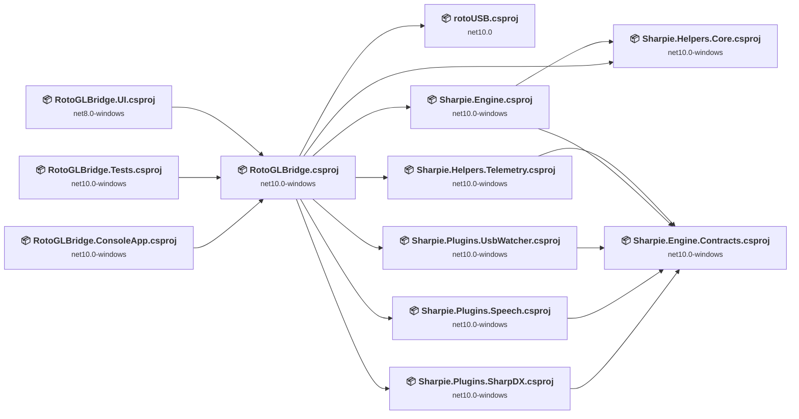

## Project Details

### sharpie\src\Plugins\Sharpie.Plugins.SharpDX\Sharpie.Plugins.SharpDX.csproj

#### Project Info

- **Current Target Framework:** net10.0-windows✅
- **SDK-style**: True
- **Project Kind:** ClassLibrary
- **Dependencies**: 1
- **Dependants**: 1
- **Number of Files**: 2
- **Lines of Code**: 119
- **Estimated LOC to modify**: 0+ (at least 0.0% of the project)

#### Dependency Graph

Legend:
📦 SDK-style project
⚙️ Classic project

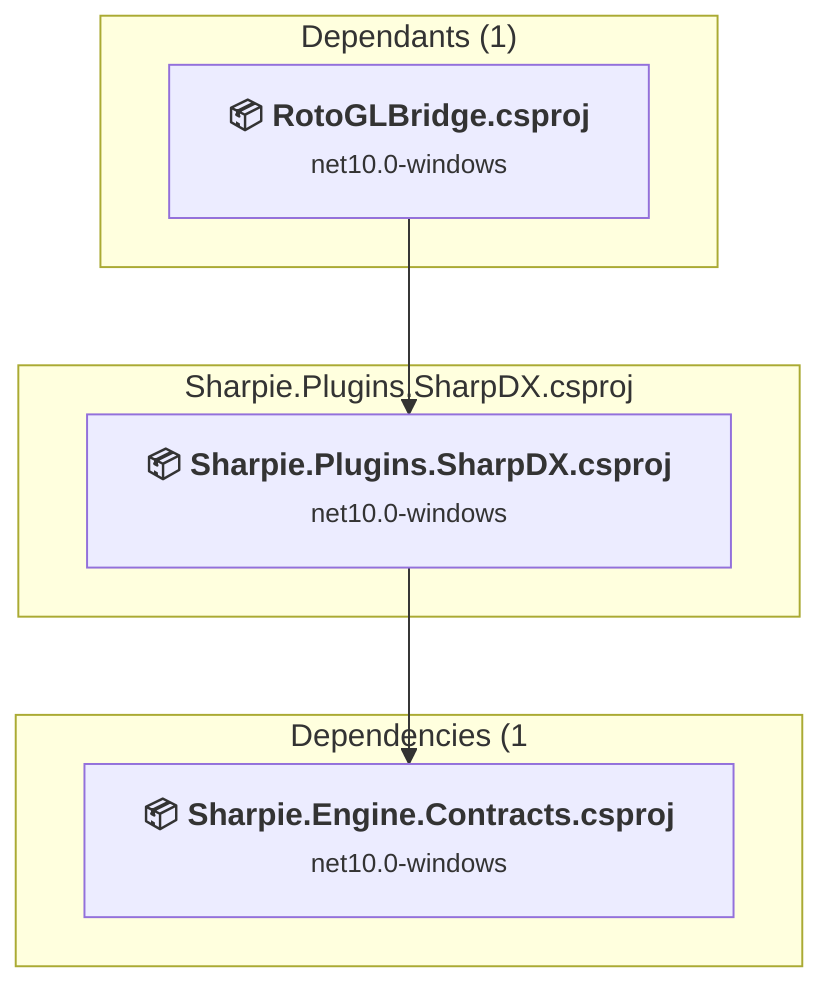

### API Compatibility

| Category | Count | Impact |
| :--- | :---: | :--- |
| 🔴 Binary Incompatible | 0 | High - Require code changes |
| 🟡 Source Incompatible | 0 | Medium - Needs re-compilation and potential conflicting API error fixing |
| 🔵 Behavioral change | 0 | Low - Behavioral changes that may require testing at runtime |
| ✅ Compatible | 0 |  |
| ***Total APIs Analyzed*** | ***0*** |  |

### sharpie\src\Plugins\Sharpie.Plugins.Speech\Sharpie.Plugins.Speech.csproj

#### Project Info

- **Current Target Framework:** net10.0-windows✅
- **SDK-style**: True
- **Project Kind:** ClassLibrary
- **Dependencies**: 1
- **Dependants**: 1
- **Number of Files**: 3
- **Lines of Code**: 196
- **Estimated LOC to modify**: 0+ (at least 0.0% of the project)

#### Dependency Graph

Legend:
📦 SDK-style project
⚙️ Classic project

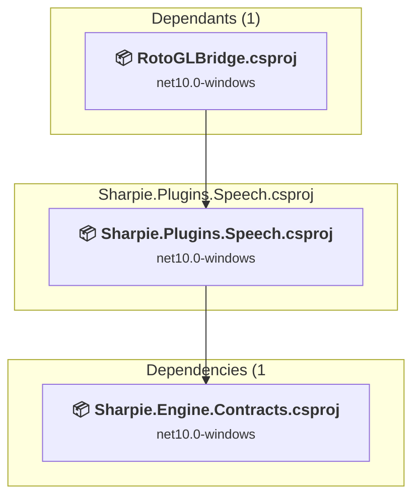

### API Compatibility

| Category | Count | Impact |
| :--- | :---: | :--- |
| 🔴 Binary Incompatible | 0 | High - Require code changes |
| 🟡 Source Incompatible | 0 | Medium - Needs re-compilation and potential conflicting API error fixing |
| 🔵 Behavioral change | 0 | Low - Behavioral changes that may require testing at runtime |
| ✅ Compatible | 0 |  |
| ***Total APIs Analyzed*** | ***0*** |  |

### sharpie\src\Plugins\Sharpie.Plugins.UsbWatcher\Sharpie.Plugins.UsbWatcher.csproj

#### Project Info

- **Current Target Framework:** net10.0-windows✅
- **SDK-style**: True
- **Project Kind:** ClassLibrary
- **Dependencies**: 1
- **Dependants**: 1
- **Number of Files**: 2
- **Lines of Code**: 209
- **Estimated LOC to modify**: 0+ (at least 0.0% of the project)

#### Dependency Graph

Legend:
📦 SDK-style project
⚙️ Classic project

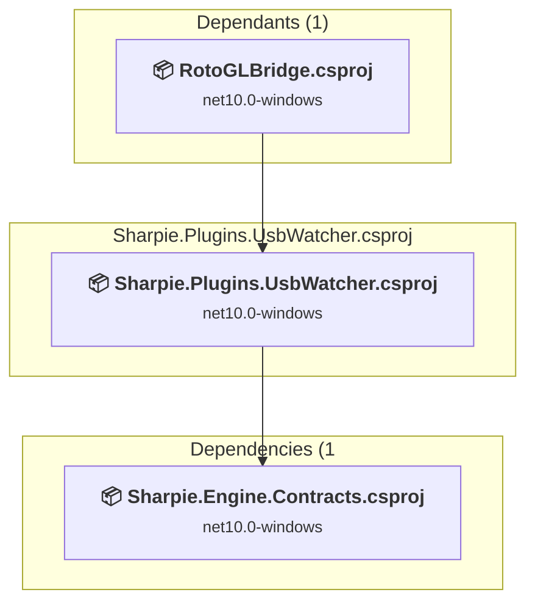

### API Compatibility

| Category | Count | Impact |
| :--- | :---: | :--- |
| 🔴 Binary Incompatible | 0 | High - Require code changes |
| 🟡 Source Incompatible | 0 | Medium - Needs re-compilation and potential conflicting API error fixing |
| 🔵 Behavioral change | 0 | Low - Behavioral changes that may require testing at runtime |
| ✅ Compatible | 0 |  |
| ***Total APIs Analyzed*** | ***0*** |  |

### sharpie\src\Sharpie\Sharpie.Engine.Contracts\Sharpie.Engine.Contracts.csproj

#### Project Info

- **Current Target Framework:** net10.0-windows✅
- **SDK-style**: True
- **Project Kind:** ClassLibrary
- **Dependencies**: 0
- **Dependants**: 5
- **Number of Files**: 16
- **Lines of Code**: 588
- **Estimated LOC to modify**: 0+ (at least 0.0% of the project)

#### Dependency Graph

Legend:
📦 SDK-style project
⚙️ Classic project

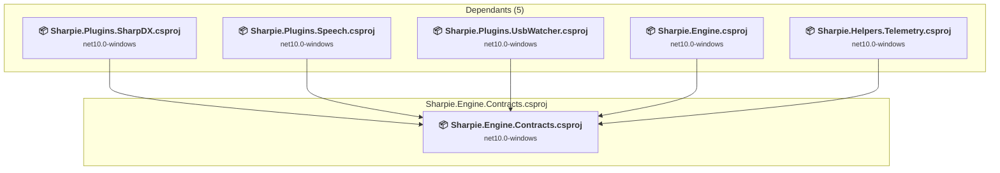

### API Compatibility

| Category | Count | Impact |
| :--- | :---: | :--- |
| 🔴 Binary Incompatible | 0 | High - Require code changes |
| 🟡 Source Incompatible | 0 | Medium - Needs re-compilation and potential conflicting API error fixing |
| 🔵 Behavioral change | 0 | Low - Behavioral changes that may require testing at runtime |
| ✅ Compatible | 0 |  |
| ***Total APIs Analyzed*** | ***0*** |  |

### sharpie\src\Sharpie\Sharpie.Engine\Sharpie.Engine.csproj

#### Project Info

- **Current Target Framework:** net10.0-windows✅
- **SDK-style**: True
- **Project Kind:** ClassLibrary
- **Dependencies**: 2
- **Dependants**: 1
- **Number of Files**: 11
- **Lines of Code**: 829
- **Estimated LOC to modify**: 0+ (at least 0.0% of the project)

#### Dependency Graph

Legend:
📦 SDK-style project
⚙️ Classic project

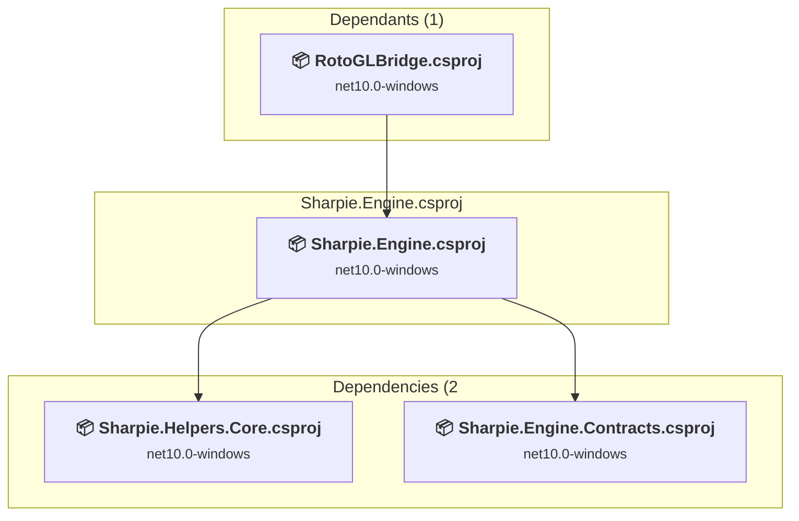

### API Compatibility

| Category | Count | Impact |
| :--- | :---: | :--- |
| 🔴 Binary Incompatible | 0 | High - Require code changes |
| 🟡 Source Incompatible | 0 | Medium - Needs re-compilation and potential conflicting API error fixing |
| 🔵 Behavioral change | 0 | Low - Behavioral changes that may require testing at runtime |
| ✅ Compatible | 0 |  |
| ***Total APIs Analyzed*** | ***0*** |  |

### sharpie\src\Sharpie\Sharpie.Helpers.Core\Sharpie.Helpers.Core.csproj

#### Project Info

- **Current Target Framework:** net10.0-windows✅
- **SDK-style**: True
- **Project Kind:** ClassLibrary
- **Dependencies**: 0
- **Dependants**: 2
- **Number of Files**: 8
- **Lines of Code**: 543
- **Estimated LOC to modify**: 0+ (at least 0.0% of the project)

#### Dependency Graph

Legend:
📦 SDK-style project
⚙️ Classic project

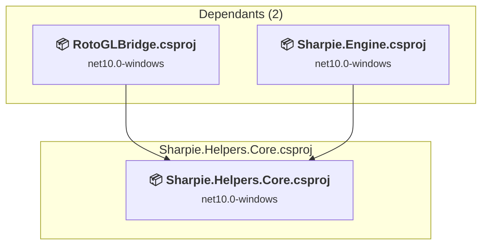

### API Compatibility

| Category | Count | Impact |
| :--- | :---: | :--- |
| 🔴 Binary Incompatible | 0 | High - Require code changes |
| 🟡 Source Incompatible | 0 | Medium - Needs re-compilation and potential conflicting API error fixing |
| 🔵 Behavioral change | 0 | Low - Behavioral changes that may require testing at runtime |
| ✅ Compatible | 0 |  |
| ***Total APIs Analyzed*** | ***0*** |  |

### sharpie\src\Sharpie\Sharpie.Helpers.Telemetry\Sharpie.Helpers.Telemetry.csproj

#### Project Info

- **Current Target Framework:** net10.0-windows✅
- **SDK-style**: True
- **Project Kind:** ClassLibrary
- **Dependencies**: 1
- **Dependants**: 1
- **Number of Files**: 10
- **Lines of Code**: 1020
- **Estimated LOC to modify**: 0+ (at least 0.0% of the project)

#### Dependency Graph

Legend:
📦 SDK-style project
⚙️ Classic project

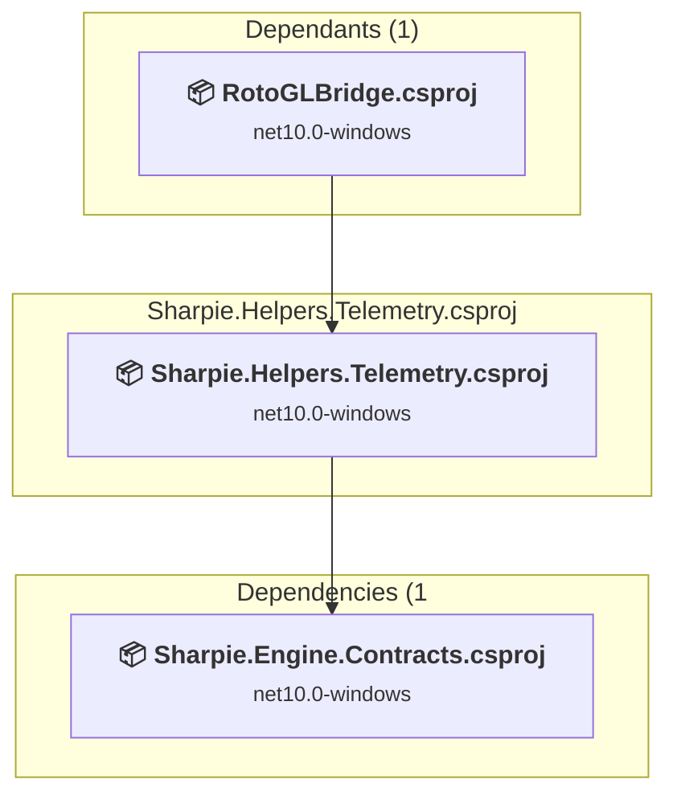

### API Compatibility

| Category | Count | Impact |
| :--- | :---: | :--- |
| 🔴 Binary Incompatible | 0 | High - Require code changes |
| 🟡 Source Incompatible | 0 | Medium - Needs re-compilation and potential conflicting API error fixing |
| 🔵 Behavioral change | 0 | Low - Behavioral changes that may require testing at runtime |
| ✅ Compatible | 0 |  |
| ***Total APIs Analyzed*** | ***0*** |  |

### src\RotoGLBridge.Console\RotoGLBridge.ConsoleApp.csproj

#### Project Info

- **Current Target Framework:** net10.0-windows✅
- **SDK-style**: True
- **Project Kind:** DotNetCoreApp
- **Dependencies**: 1
- **Dependants**: 0
- **Number of Files**: 5
- **Lines of Code**: 359
- **Estimated LOC to modify**: 0+ (at least 0.0% of the project)

#### Dependency Graph

Legend:
📦 SDK-style project
⚙️ Classic project

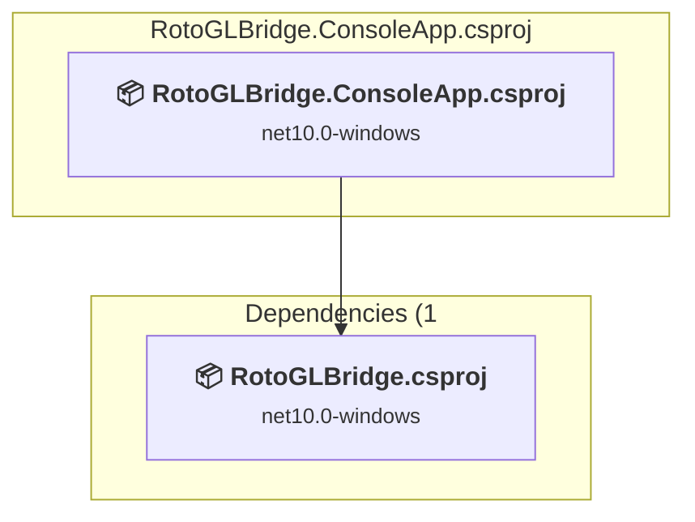

### API Compatibility

| Category | Count | Impact |
| :--- | :---: | :--- |
| 🔴 Binary Incompatible | 0 | High - Require code changes |
| 🟡 Source Incompatible | 0 | Medium - Needs re-compilation and potential conflicting API error fixing |
| 🔵 Behavioral change | 0 | Low - Behavioral changes that may require testing at runtime |
| ✅ Compatible | 0 |  |
| ***Total APIs Analyzed*** | ***0*** |  |

### src\RotoGLBridge.Tests\RotoGLBridge.Tests.csproj

#### Project Info

- **Current Target Framework:** net10.0-windows✅
- **SDK-style**: True
- **Project Kind:** DotNetCoreApp
- **Dependencies**: 1
- **Dependants**: 0
- **Number of Files**: 5
- **Lines of Code**: 477
- **Estimated LOC to modify**: 0+ (at least 0.0% of the project)

#### Dependency Graph

Legend:
📦 SDK-style project
⚙️ Classic project

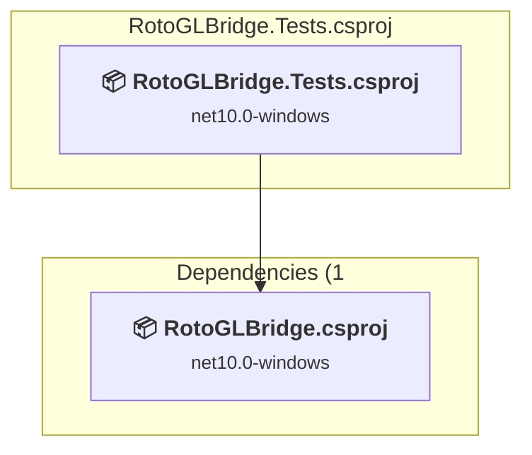

### API Compatibility

| Category | Count | Impact |
| :--- | :---: | :--- |
| 🔴 Binary Incompatible | 0 | High - Require code changes |
| 🟡 Source Incompatible | 0 | Medium - Needs re-compilation and potential conflicting API error fixing |
| 🔵 Behavioral change | 0 | Low - Behavioral changes that may require testing at runtime |
| ✅ Compatible | 0 |  |
| ***Total APIs Analyzed*** | ***0*** |  |

### src\RotoGLBridge.UI\RotoGLBridge.UI.csproj

#### Project Info

- **Current Target Framework:** net8.0-windows
- **Proposed Target Framework:** net10.0-windows
- **SDK-style**: True
- **Project Kind:** Wpf
- **Dependencies**: 1
- **Dependants**: 0
- **Number of Files**: 16
- **Number of Files with Incidents**: 1
- **Lines of Code**: 895
- **Estimated LOC to modify**: 0+ (at least 0.0% of the project)

#### Dependency Graph

Legend:
📦 SDK-style project
⚙️ Classic project

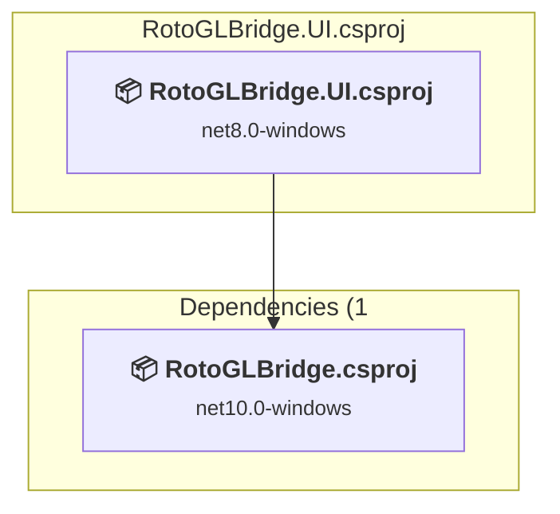

### API Compatibility

| Category | Count | Impact |
| :--- | :---: | :--- |
| 🔴 Binary Incompatible | 0 | High - Require code changes |
| 🟡 Source Incompatible | 0 | Medium - Needs re-compilation and potential conflicting API error fixing |
| 🔵 Behavioral change | 0 | Low - Behavioral changes that may require testing at runtime |
| ✅ Compatible | 0 |  |
| ***Total APIs Analyzed*** | ***0*** |  |

### src\RotoGLBridge\RotoGLBridge.csproj

#### Project Info

- **Current Target Framework:** net10.0-windows✅
- **SDK-style**: True
- **Project Kind:** ClassLibrary
- **Dependencies**: 7
- **Dependants**: 3
- **Number of Files**: 27
- **Lines of Code**: 2147
- **Estimated LOC to modify**: 0+ (at least 0.0% of the project)

#### Dependency Graph

Legend:
📦 SDK-style project
⚙️ Classic project

```mermaid
flowchart TB
    subgraph upstream["Dependants (3)"]
        P1["<b>📦&nbsp;RotoGLBridge.ConsoleApp.csproj</b><br/><small>net10.0-windows</small>"]
        P2["<b>📦&nbsp;RotoGLBridge.Tests.csproj</b><br/><small>net10.0-windows</small>"]
        P3["<b>📦&nbsp;RotoGLBridge.UI.csproj</b><br/><small>net8.0-windows</small>"]
        click P1 "#srcrotoglbridgeconsolerotoglbridgeconsoleappcsproj"
        click P2 "#srcrotoglbridgetestsrotoglbridgetestscsproj"
        click P3 "#srcrotoglbridgeuirotoglbridgeuicsproj"
    end
    subgraph current["RotoGLBridge.csproj"]
        MAIN["<b>📦&nbsp;RotoGLBridge.csproj</b><br/><small>net10.0-windows</small>"]
        click MAIN "#srcrotoglbridgerotoglbridgecsproj"
    end
    subgraph downstream["Dependencies (7"]
        P11["<b>📦&nbsp;Sharpie.Helpers.Core.csproj</b><br/><small>net10.0-windows</small>"]
        P5["<b>📦&nbsp;rotoUSB.csproj</b><br/><small>net10.0</small>"]
        P12["<b>📦&nbsp;Sharpie.Helpers.Telemetry.csproj</b><br/><small>net10.0-windows</small>"]
        P7["<b>📦&nbsp;Sharpie.Plugins.Speech.csproj</b><br/><small>net10.0-windows</small>"]
        P8["<b>📦&nbsp;Sharpie.Plugins.UsbWatcher.csproj</b><br/><small>net10.0-windows</small>"]
        P6["<b>📦&nbsp;Sharpie.Plugins.SharpDX.csproj</b><br/><small>net10.0-windows</small>"]
        P10["<b>📦&nbsp;Sharpie.Engine.csproj</b><br/><small>net10.0-windows</small>"]
        click P11 "#sharpiesrcsharpiesharpiehelperscoresharpiehelperscorecsproj"
        click P5 "#srcrotousbrotousbcsproj"
        click P12 "#sharpiesrcsharpiesharpiehelperstelemetrysharpiehelperstelemetrycsproj"
        click P7 "#sharpiesrcpluginssharpiepluginsspeechsharpiepluginsspeechcsproj"
        click P8 "#sharpiesrcpluginssharpiepluginsusbwatchersharpiepluginsusbwatchercsproj"
        click P6 "#sharpiesrcpluginssharpiepluginssharpdxsharpiepluginssharpdxcsproj"
        click P10 "#sharpiesrcsharpiesharpieenginesharpieenginecsproj"
    end
    P1 --> MAIN
    P2 --> MAIN
    P3 --> MAIN
    MAIN --> P11
    MAIN --> P5
    MAIN --> P12
    MAIN --> P7
    MAIN --> P8
    MAIN --> P6
    MAIN --> P10

```

### API Compatibility

| Category | Count | Impact |
| :--- | :---: | :--- |
| 🔴 Binary Incompatible | 0 | High - Require code changes |
| 🟡 Source Incompatible | 0 | Medium - Needs re-compilation and potential conflicting API error fixing |
| 🔵 Behavioral change | 0 | Low - Behavioral changes that may require testing at runtime |
| ✅ Compatible | 0 |  |
| ***Total APIs Analyzed*** | ***0*** |  |

### src\RotoUSB\rotoUSB.csproj

#### Project Info

- **Current Target Framework:** net10.0✅
- **SDK-style**: True
- **Project Kind:** ClassLibrary
- **Dependencies**: 0
- **Dependants**: 1
- **Number of Files**: 12
- **Lines of Code**: 1818
- **Estimated LOC to modify**: 0+ (at least 0.0% of the project)

#### Dependency Graph

Legend:
📦 SDK-style project
⚙️ Classic project

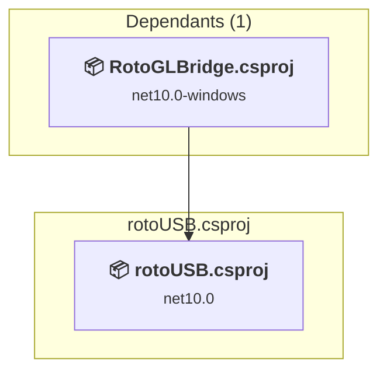

### API Compatibility

| Category | Count | Impact |
| :--- | :---: | :--- |
| 🔴 Binary Incompatible | 0 | High - Require code changes |
| 🟡 Source Incompatible | 0 | Medium - Needs re-compilation and potential conflicting API error fixing |
| 🔵 Behavioral change | 0 | Low - Behavioral changes that may require testing at runtime |
| ✅ Compatible | 0 |  |
| ***Total APIs Analyzed*** | ***0*** |  |

